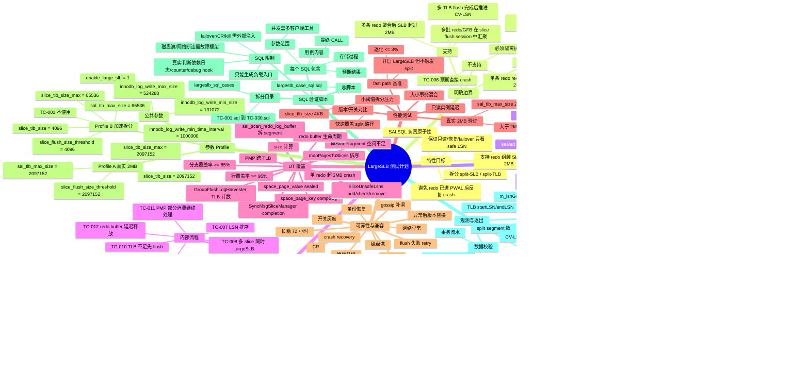

# LargeSLB 测试计划思维导图

```mermaid
mindmap
  root((LargeSLB 测试计划))
    特性目标
      支持 redo 组装 SLB 后超过 2MB
      SALSQL 负责原子性
      拆分 split-SLB / split-TLB
      避免 redo 已进 PWAL 后反复 crash
      保证只读/恢复/failover 只看 safe LSN
    明确边界
      支持
        多条 redo 聚合后 SLB 超过 2MB
        多批 redo/GFB 在 slice flush session 中汇聚
        多 TLB flush 完成后推进 CV-LSN
      不支持
        单条 redo record 自身超过 2MB
        TC-006 预期直接 crash
        必须隔离执行
      当前参数限制
        innodb_log_write_max_size 最大 524288
        单次 redo write 最大约 512KB
        不能依赖单次 redo write 到 2MB
        正向用例依赖多批 redo/GFB 汇聚
    核心链路
      GFB Parsing
        size 计算包含 record 元数据
        COMPACT 记录超过阈值拆 segment
        compSeg 从 0 递增
        sealed 标记 segment 状态
      Mapping to Slice
        page_ref_map_t 按 LSN 递增排序
        避免 split-SLB LSN 范围重叠
        计算 GFB 所需 TLB 总数
        fast path 避免普通场景退化
      SLB/TLB 生成
        fillSliceFragment 检查剩余空间
        TLB 不足先 flush
        PMP 部分消费后继续处理
        redo buffer 全部复制完成后释放
      LSN 安全推进
        m_lsnGuard 跟踪 unsafe LSN
        非尾部 split TLB 不推进 persistLSN
        completion handler 检查 guard
        LSN-Watcher 检查 guard
      备机通信
        所有 TLB 完成后才发送 SYNC_MSG_SLICE
        CV-LSN 只推进到 safe boundary
        只读实例读取 safe CV-LSN
    功能用例 TC-001 到 TC-030
      基础与边界
        TC-001 fast path 回归
        TC-002 单会话单 slice 多批 redo 拆分
        TC-003 多 GFB 汇聚同一 SLB
        TC-004 同 page-id 多 COMPACT segment
        TC-005 2MB-1 / 2MB / 2MB+1
        TC-006 单 redo 超 2MB 不支持 crash
      内部流程
        TC-007 LSN 排序
        TC-008 多 slice 同时 LargeSLB
        TC-009 GFB TLB 总数计算
        TC-010 TLB 不足先 flush
        TC-011 PMP 部分消费继续处理
        TC-012 redo buffer 延迟释放
      LSN 与同步
        TC-013 unsafe LSN guard
        TC-014 completion handler / LSN-Watcher
        TC-015 全部 TLB 完成前不发 SYNC_MSG_SLICE
        TC-016 只读实例 safe CV-LSN
        TC-017 recycle/release LSN
      恢复与高可用
        TC-018 failover
        TC-019 CR 起点
        TC-020 Slice Store 补洞
        TC-021 异常后版本替换
      参数与异常
        TC-022 enable_large_slb 开关
        TC-023 参数合法性
        TC-024 sal_tlb_max_size 矩阵
        TC-025 flush 失败重试
        TC-026 crash replay
        TC-027 磁盘满
        TC-028 网络抖动/断连
      稳定性与混合负载
        TC-029 长稳写入
        TC-030 大小事务混合
    UT 覆盖
      size 计算
      sal_scan_redo_log_buffer 拆 segment
      space_page_key compSeg
      space_page_value sealed
      mapPagesToSlices 排序
      GroupFlushLogHarvester TLB 计数
      fillSliceFragment 空间不足
      PMP 跨 TLB
      redo buffer 生命周期
      SliceUnsafeLsns add/check/remove
      SyncMsgSliceManager completion
      单 redo 超 2MB crash
      行覆盖率 >= 95%
      分支覆盖率 >= 85%
    性能测试
      fast path 基准
        开启 LargeSLB 但不触发 split
        退化 <= 3%
      小阈值拆分压力
        slice_tlb_size 4KB
        快速覆盖 split 路径
      真实 2MB 验证
        sal_tlb_max_size 2MB
        大于 2MB 才拆
      大小事务混合
      只读实例延迟
      版本/开关对比
    可靠性与兼容
      长稳 72 小时
      crash recovery
      flush 失败 retry
      网络异常
      磁盘满
      failover
      CR
      gossip 补洞
      原地升级
      异常后版本替换
      开关灰度
      备份恢复
    参数 Profile
      公共参数
        enable_large_slb = 1
        innodb_log_write_max_size = 524288
        innodb_log_write_min_time_interval = 1000000
        innodb_log_write_min_size = 131072
      Profile A 真实 2MB
        sal_tlb_max_size = 2097152
        slice_tlb_size = 2097152
        slice_flush_size_threshold = 2097152
        slice_tlb_size_max = 2097152
      Profile B 加速拆分
        sal_tlb_max_size = 65536
        slice_tlb_size = 4096
        slice_flush_size_threshold = 4096
        slice_tlb_size_max = 65536
        TC-001 不使用
    SQL 验证脚本
      总脚本
        largeslb_case_sql.sql
      拆分目录
        largeslb_sql_cases
        TC-001.sql 到 TC-030.sql
      每个 SQL 包含
        用例内容
        预期结果
        参数范围
        存储过程
        最终 CALL
      SQL 限制
        只能生成负载入口
        并发需多客户端工具
        failover/CR/kill 需外部注入
        磁盘满/网络断连需故障框架
        真实判断依赖日志/counter/debug hook
    观测与退出
      观测指标
        large_mtr
        large_mtr_size
        split segment 数
        TLB startLSN/endLSN
        TLB completion
        SYNC_MSG_SLICE
        CV-LSN/persistLSN
        m_lsnGuard size
      数据校验
        主库/只读 row count
        checksum
        事务流水
        恢复后一致性
      退出标准
        P0 全通过
        P1 通过率 >= 95%
        72 小时长稳通过
        crash/failover/CR/补洞通过
        fast path 性能达标
```

